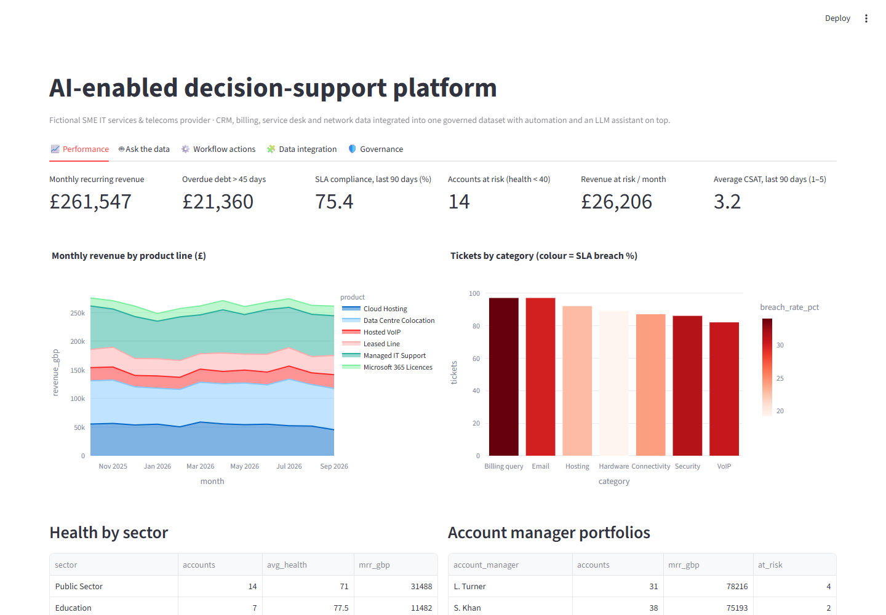
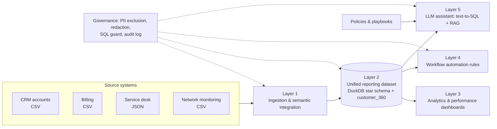
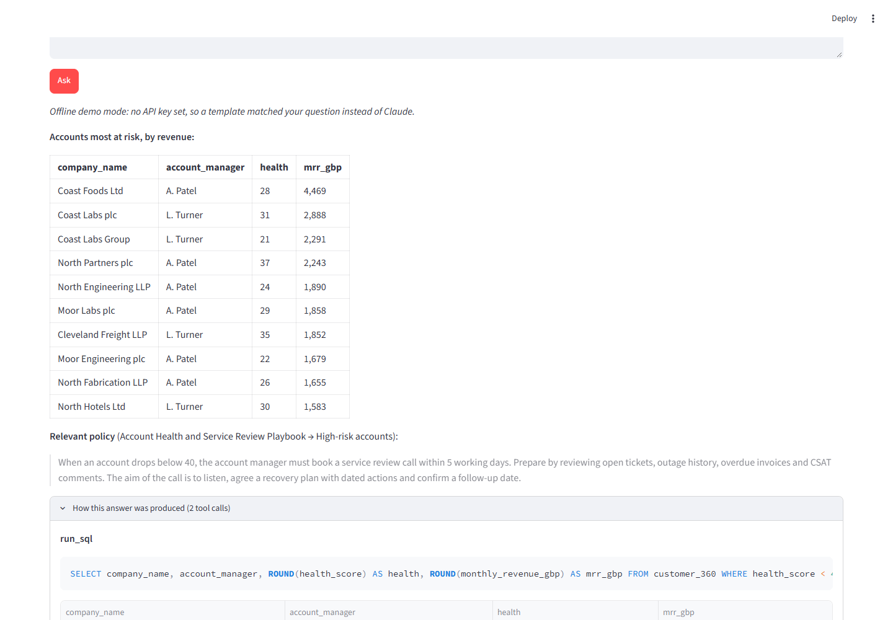
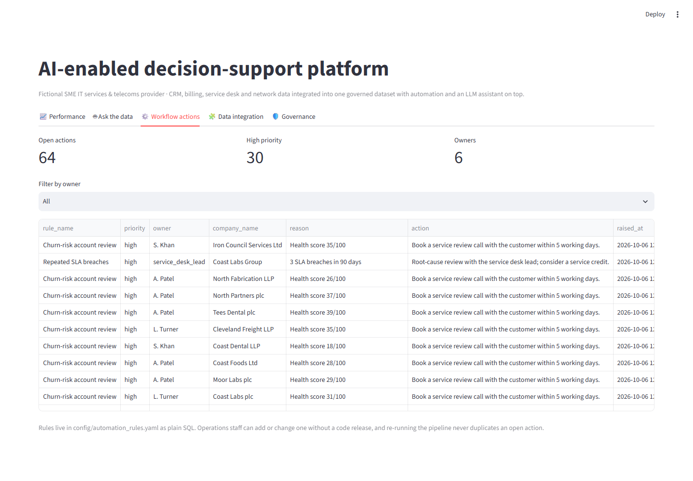
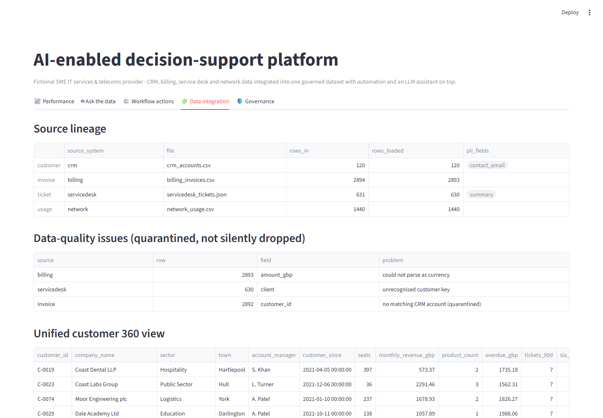

# AI-Enabled Decision-Support Platform

[](https://github.com/malikwaqas077/ai-decision-support-platform/actions/workflows/ci.yml)

A working reference implementation of a **five-layer AI-assisted business intelligence platform** for an SME.
It takes data from separate operational systems, joins it into one governed reporting dataset, visualises
performance, automates follow-up workflows and adds an LLM assistant that answers business questions from the
data and company policy.

The demo company is a fictional SME **IT services and telecoms provider** (connectivity, hosted VoIP, cloud
hosting, managed IT support, data centre colocation). All data is synthetic.



## The five layers



| Layer | What it does | Where |
|---|---|---|
| **1. Data ingestion & semantic integration** | Four systems with different IDs (`C-0007`, `CUST0007`, `NB/0007`, `7`), date formats, currency strings and casing are mapped onto one canonical vocabulary by **configuration, not code** (`config/source_mappings.yaml`). Bad rows are logged and quarantined, never silently dropped. Lineage is recorded per source. | `dsp/ingest.py` |
| **2. Unified reporting dataset** | A DuckDB star schema (`dim_customer`, `fact_invoice`, `fact_ticket`, `fact_usage`) plus a `customer_360` view with an **explainable health score**. PII (contact emails, ticket free text) never enters this layer. | `dsp/warehouse.py` |
| **3. Business analytics & visualisation** | Each KPI (MRR, overdue debt, SLA compliance, revenue at risk, CSAT) is defined once and reused everywhere, then shown in a Streamlit dashboard. | `dsp/analytics.py`, `app.py` |
| **4. Business workflow automation** | Declarative rules written in SQL (`config/automation_rules.yaml`) raise owned, prioritised actions such as churn-risk reviews, SLA escalations, debt chasing and upsell prompts. Re-running never duplicates an open action. Every evaluation is audited. | `dsp/automation.py` |
| **5. AI-integrated LLM capability** | A Claude-powered assistant with two tools: **read-only SQL** over the unified dataset and **retrieval over company policies** (RAG, BM25). It answers with real figures and the policy it relied on, and shows every query it ran. An offline mode lets the platform be evaluated without an API key. | `dsp/llm.py`, `dsp/retrieval.py` |

### Security and governance

Each layer is built for a live environment, not only for a demo:

- **PII minimisation:** contact details and ticket text are excluded from the reporting layer, and questions
  are redacted (emails, UK phone numbers) before they reach the LLM.
- **LLM SQL guard:** model-written SQL is parsed (sqlglot) and only a single `SELECT` over approved tables is
  allowed. DDL, DML, file access and other tables are blocked, and a row cap is applied.
- **Audit log:** every ingestion run, automation rule and LLM tool call is written to an append-only JSONL log
  and shown in the app.
- **Configuration over code:** source mappings and business rules live in YAML or SQL, so the business can review
  and change them without a code release.

## Screenshots

| Ask the data (Layer 5) | Workflow actions (Layer 4) |
|---|---|
|  |  |



## Run it

```bash
pip install -r requirements.txt
python -m dsp.pipeline          # Layers 1–4 end to end, prints lineage and action counts
streamlit run app.py            # dashboard + assistant
python -m pytest -q             # 21 tests
```

To let Claude plan its own queries, set `ANTHROPIC_API_KEY` or paste a key into the *Ask the data* tab.
Without a key, the assistant runs in offline demo mode: intent templates plus the same governed SQL and
retrieval tools.

Example questions:
- *Which high-value accounts are at risk, and what should we do this week?*
- *Who owes us money and should anyone go on credit hold?*
- *Which customers are owed a service credit under the SLA policy?*

## Design choices

- **DuckDB** gives a fast, zero-infrastructure analytical store for an SME. The same SQL moves to Postgres,
  Azure SQL or BigQuery later.
- **The health score uses transparent weighted rules, not a black-box model.** Account managers need to see
  *why* an account is flagged before they act on it. A trained churn model can replace it once there is labelled
  churn history.
- **BM25 retrieval** needs no vector database and is easy to inspect. The `search(query, k)` interface lets an
  embedding index slot in without changing the LLM layer.
- **Tool use instead of prompt-stuffing.** The LLM never sees raw tables. It asks for what it needs through
  governed tools, and every call is visible to the user and in the audit log.

## Project layout

```
config/            source mappings (Layer 1) and automation rules (Layer 4)
data/              synthetic data generator and raw source extracts
dsp/               platform package: ingest, warehouse, analytics, automation, llm, retrieval, governance
knowledge/         company policies and playbooks used for retrieval
app.py             Streamlit front end
tests/             pytest suite, including a mocked Claude tool-use loop
```

---

Built by [Waqas Ahmad](https://www.linkedin.com/in/waqas-ahmad09/). MSc AI & Data Science, University of Hull.
